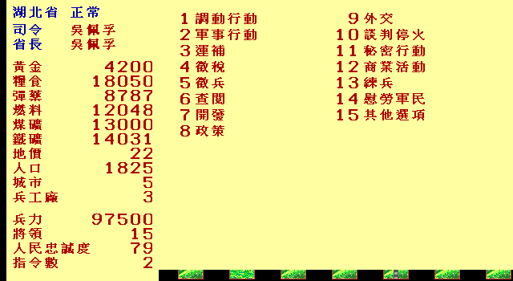
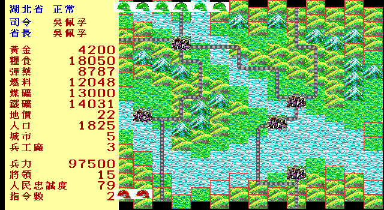

# 大時代的故事 remake

漢堂國際資訊《大時代的故事》(1992, MS-DOS) 的逆向、引擎重寫與多語系專案。
在 Go / Ebiten 上重寫一套跨平台引擎，還原原版繁體中文文本，另做英文與日文語系。

1992 年 10 月，漢堂出了這款以民國初年為背景的回合制戰棋。它扭轉了前作《隋唐群雄傳》
的評價，也是《天外聖劍錄》《炎龍騎士團》之前的那一部。三十四年過去，原始碼沒有留下來，
發行商也已經不在，剩下的只有一份 148 個檔案的遊戲目錄。

這個專案要把它讀懂，然後在現代平台上重新蓋一遍。

## 讓歷史說今天的人聽得懂的話

民國初年的白話文運動面對的，不只是「文言還是白話」的文體選擇，而是知識能否走出少數人
熟悉的書寫慣例，進入教育、報刊與日常生活。它留給今天的一項重要啟示是：保存文化，
不等於把知識鎖在舊有的表達形式裡；傳播技術與閱讀習慣改變時，語言也要繼續發展，
更多人才有機會理解、討論，再把文化傳下去。

一百年後，媒介從紙張走到電腦與手機，遊戲介面也形成了新的閱讀語法。若玩家必須先猜懂
「司令，欲調動何將？」才能開始理解遊戲，那麼被保存下來的可能只是一件可觀看、卻不再
容易進入的舊物。尤其對 2000 年後出生、第一次接觸民國初年人物與軍政制度的玩家而言，
介面的陌生不應成為認識歷史的資格考試。

因此重製版不把現代化理解成「把舊東西換掉」，而是讓兩種入口並存：

- **圖形可切換**：原版點陣圖、現代重繪與軍事符號並存，不覆蓋原始風格。
- **語言可切換**：原典文句完整保留；現代白話可把「何將」寫成「哪位將領」、
  把「欲如何調動？」寫成「要怎麼調動？」。
- **規則不切換**：無論使用哪一套圖形或文字，候選項、數值、結果與存檔都完全相同。

兩套呈現不是「舊版被新版取代」，而是通往同一份內容的兩個入口：現代圖形先幫玩家看懂
地形、部隊與狀態，現代白話先幫玩家理解要做的事；玩家可以隨時切回原版點陣圖與原典
文句，觀察 1992 年的美術、字模與電腦中文介面。切換也不必綁在一起——可以用現代圖形
讀原典，也可以保留復古畫面而改用現代白話。

這不是替歷史人物改寫發言，也不是用今天的價值觀補寫史料。現代白話只處理操作介面的
理解門檻；人物、事件、地名與制度仍以可追溯的史料呈現，推論與未知也必須如實標示。
原典永遠保留、差異可以回查、玩法不因呈現方式而改變。

因此，這個重製專案想保存的不是一包只能被模擬器打開的舊檔案，而是一段仍能被遊玩、
被閱讀、被提問，也能讓下一個世代主動走近的文化與歷史。遊戲在這裡不只是歷史題材的
包裝，而是一種讓文化重新進入日常經驗的媒介。

完整的切換架構與差異契約見
[`docs/design/10-visual-modernization.md`](./docs/design/10-visual-modernization.md)。

## 目前進度

| 里程碑 | 狀態 |
|---|---|
| M0 資產解密 | **完成**——`.15` 字模、`.TPC`／`.RGB`、`.GLB`／`.GTB`、`RAIL.TPC`、`PLACD.SAV`、`NEWSDATA.DAT` |
| M1 文本還原鏈 | **詞表層完成**；敘事文本已找到（是畫成圖的，不是字模序列）|
| M2 執行檔反組譯 | 進行中——五支已盤點，戰鬥模組已定位 |
| M3 規則規格 | 4 份 READY（地圖、將領、省份、戰場圖塊）+ `docs/mechanics/` 機制文件 |
| M4 規則層 | 進行中——地圖、將領、省份、戰場 |
| M5 呈現層 | **政略畫面 + 互動**——13 個欄位對實機零誤差、15 項指令選單、戰場圖塊、參戰單位與人物自傳頁 |
| M6–M7 多語系／發行 | 未開始 |
| 現代圖示／modern UI | **設計完成、資產與主題載入器未實作**；目前展示圖仍是原版點陣素材，不能稱為 modern UI |
| 原典／現代白話 | **操作介面大部分已接通**；外交與其他選項 O3／O4 尚缺，劇情對話／敘事文本尚未進入逐句白話化 |
| 滑鼠／Android 觸控 | M0–M1 已涵蓋選單、長清單與數字鍵盤；M2 已接戰鬥相鄰格移動／攻擊，Android 封裝與實機驗證待續 |

DOSBox 實測已通，可載入存檔進政略階段。詳細現況見 [`CONTEXT.md`](./CONTEXT.md)。

```sh
tools/go.sh run ./cmd/dsds -game workplace/orig/game      # 需要顯示器
tools/go.sh run ./cmd/dsds -wording plain                 # 現代白話操作介面（未涵蓋劇情敘事）
tools/go.sh run ./cmd/screenshot -province 26             # 無頭產出政略畫面 PNG
tools/go.sh run ./cmd/screenshot -province 26 -menu        # 換成 15 項指令選單
tools/go.sh run ./cmd/screenshot -province 19 -units      # 加上參戰單位圖示
tools/go.sh test ./...                                     # 逐像素驗證
```

在「查閱將領」清單或詳細資料頁按 `B` 可開啟人物自傳；左右鍵切換人物，
`Space`／`PgUp`／`PgDn` 翻頁，`ESC` 或 `B` 返回。這是重製版新增的唯讀文化保存功能，
不改變遊戲狀態；目前 326 位有自撰生平，其餘人物會明示「查無可靠傳記記載」。

在政略指令選單按 `O` 可開啟 remake「顯示設定」，於遊戲中切換原典用語／現代白話。
選擇會寫入 `$XDG_CONFIG_HOME/dsds/prefs.json`（未設定 XDG 時使用平台設定目錄），
不寫入遊戲存檔；`-wording` 可在單次啟動時優先覆寫偏好。
十五項政略主選單、調動、運補、徵兵／重新整編、查閱、發展、政策／自治／產能、
商業、練兵、秘密行動、人物自傳及其他選項 O0–O2 已接上雙用語。外交、媒體選項
O3／O4，以及劇情對話／敘事文本仍待逐項處理；這裡的「現代白話」目前主要指操作介面，
不能宣稱全遊戲對話已完成。

在政略指令選單按 `8` 進入原版「政策」：第一項「授權自治」已可操作，
能在同一項指令內切換多個合法省份；第二項「產能分配」也已完成，可調整鐵礦、煤礦、
石油與糧食百分比，黃金為剩餘產能；四個存檔欄位與
五種資源對應已完成 IDA 證據與真實存檔閉環。

## 目前畫得出什麼

載入民國 15 年 7 月的原版存檔，湖北省。左邊是政略主畫面與 15 項指令選單，
右邊是同一個省的六角格地圖：





> 兩張都是 `cmd/screenshot` 在無頭環境合成的，沒有經過 DOSBox。
> 畫面上的中文字模與地形、部隊圖示都來自 1992 年的原版檔案——
> 這是文化資產保存的成果展示，本專案不散布原版的執行檔或資料檔本身
> （見[授權與素材](#授權與素材)）。

> 2026-08-03 已用目前 renderer 重產。這兩張刻意展示復古圖形路徑；現代圖示仍在
> 設計階段，尚無可誠實展示的遊戲內 modern 截圖。

政略畫面的 13 個欄位**全部與 DOSBox 實機截圖一致**：

| 欄位 | 湖北（民國 15 年 7 月存檔）|
|---|---|
| 司令／省長 | 吳佩孚／吳佩孚 |
| 黃金／糧食／彈藥 | 4200／18050／8787 |
| 燃料／煤礦／鐵礦 | 12048／13000／14031 |
| 地價／人口 | 22／1825 萬 |
| 城市／兵工廠 | 5／3 |
| **兵力／將領數** | **97500／15** |
| 人民忠誠度 | 79 |

兵力與將領數不是存檔裡的欄位——是把 `MAN(1).DAT` 裡所屬省為 26 的
15 位將領兵力加總出來的，所以會超過 u16。

右側戰場用原版的 `NEWTERR.TPC` 圖塊畫，鐵路疊 `RAIL.TPC`：
湖北看得到長江橫貫、六條鐵路連成路網、跨江處是鐵橋。

## 已經解開的：文字是怎麼存的

這款遊戲整個目錄用 Big5 解碼，中文命中數是零——但畫面上滿滿都是中文。

原因不是加密，是它根本不存碼點。文字直接以**字模序列**存在，每 `w` 個 16×15 點陣字模
組成一個詞條，不足的格子填全零字模。程式從 `k × w × 30` 取 bytes 直接送 BGI `putimage`，
中間沒有任何索引表。

51 個字模檔、6,174 個字模已全量反查回 Big5：

| 內容 | 數量 |
|---|---|
| 39 個省份的地名表（城市、山川、鐵路、關隘）| `TN15.1`–`TN15.39` |
| 中國將領姓名（分三個時期）| 274 + 106 + 106 人 |
| 日本將領姓名 | 170 人 |
| UI 詞彙（二字／三字／四字分檔）| 231 + 57 + 51 條 |
| 部隊番號（含「第␣集團軍」這類數字佔位模板）| 75 條 |

字形 100% 出自倚天中文系統的 16×15 字庫，唯一的例外是一個逗號——經二維位移窮舉確認，
它是倚天「，」左移 3 px、下移 2 列的版本。

完整規格見 [`docs/formats/01-glyph-text.md`](./docs/formats/01-glyph-text.md)。

## 已經解開的：一張戰場是怎麼組出來的

每個省有一張 14×14 的戰場，資料分散在三個檔案，各管一件事：

| 檔案 | 每格存什麼 |
|---|---|
| `WARPOS.DAT` | 這一格屬於哪個鄰省（0 = 本省腹地）——同時也是鄰接表的來源 |
| `TERNAME.DAT` | 地名索引，指向該省的 `TN15.<省>`（漢口、長江、大別山…）|
| `NWMAP.DAT` | 地物編號，決定畫哪一張 `NEWTERR.TPC` 圖塊 |

鐵路壓在同一個 u16 裡，用 `30 + 25×圖塊 + 地形` 編碼，拆出來疊上
`RAIL.TPC` 的鐵軌。驗證方式是把每省「地物 = 城市」的格數去對省份資料表的
城市數欄位——**39 個省全部吻合**。

湖北解出來是長江橫貫、五座城市、六條鐵路連成路網、跨江處是鐵橋；
河北是長城橫貫北緣配五座關隘。規格見
[`docs/spec/04-battlefield-tiles.md`](./docs/spec/04-battlefield-tiles.md)。

## 已經解開的：省份資料表

`TOWN(N).DAT` 是三個時期的初始省份狀態，`SAVE(N).DT1` 前段是同一個結構
（39 省 × 37 bytes，相位差 4 bytes）。六種資源、人口、城市數、地價、
兵工廠數、忠誠度、司令、省長、鄰省列表全部定名，對 DOSBox 實機截圖零誤差。

最有說服力的驗證不是數字對得上，是**司令欄位解出來就是 1926 年的割據圖**：
孫傳芳轄江蘇、安徽、浙江、福建、江西——史上的「五省聯軍」，一個不多一個不少；
張作霖轄東北九省加河北、山東；兩廣歸蔣中正。存檔裡省長會與司令分化成實際
駐守的人：遼寧張學良、山東張宗昌、江西盧香亭，湖南已易主為蔣中正／何應欽
——那正是民國 15 年 8 月北伐軍攻下長沙的時間點。

## 定位

文化資產保存。核心規則對齊 1992 原版，外殼（解析度、視窗、操作、存檔相容）現代化，
每一項改動都在文件裡標記為 remake 差異。不做玩法設計改動。

專案的工作紀律有兩條寫死的原則：**完整性優先於投報**（不以成本為由跳過任何素材），
以及 **spec 齊了才實作**（反組譯 → 規格 → 程式）。細節見 [`CLAUDE.md`](./CLAUDE.md)。

## 目錄

```
docs/formats/     檔案格式規格
docs/re/          反組譯筆記
docs/spec/        實作規格（標 DRAFT / READY，只有 READY 能動手）
docs/playtest/    實跑驗收紀錄
internal/assets/  純解碼層，不認識 Ebiten
internal/game/    規則層，不認識畫面
internal/ui/      Ebiten 呈現層
tools/            docker 包裝腳本與逆向工具
```

所有建置與工具一律走 docker，不裝進系統環境。

## 授權與素材

本專案**不散布原版執行檔、資料檔、美術或音樂，也不散布倚天字型**。
公開產出只有引擎程式碼、逆向筆記與翻譯文本，玩家需自備合法原版。
版控內容每次 commit 前都會跑 `tools/deny_scan.sh` 掃描原版資產。

**唯一的例外是 `docs/images/` 裡的展示截圖。** 那些畫面是由原版檔案
算出來的，因此含有原版的字模與美術。放它們的理由是：這個專案的成果
本來就是「能不能把原版畫回來」，沒有畫面就無從判斷進度。截圖不能拿來
還原任何一個原版檔案——它們是渲染結果，不是資產本身。

`deny_scan.sh` 對這條例外有專門的檢查：**PNG 只准出現在 `docs/images/`**，
別的位置一律報錯。這樣「例外」是白名單而不是漏洞。

## 致謝

漢堂國際資訊，以及當年做出這款遊戲的程式（林明輝、沈友瑋）與音樂（吳宗凱、游戲工場）。
還有倚天中文系統——三十四年後，讓這些字重新被讀出來的，還是同一套點陣字。
